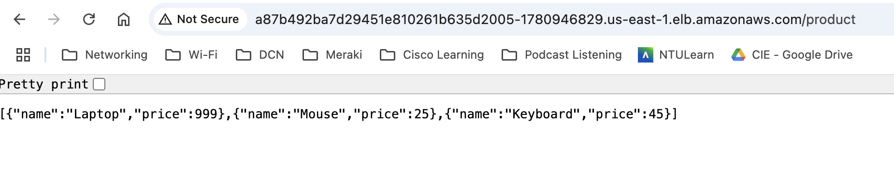
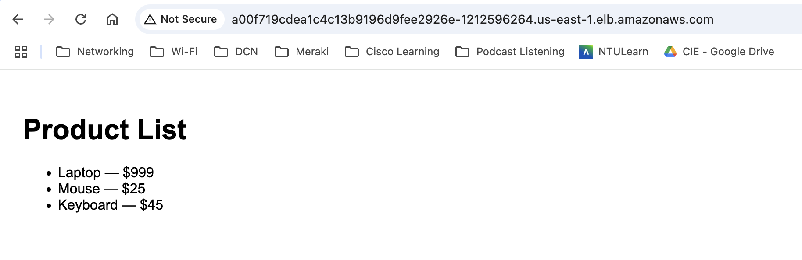

# CE9 CapStone Project

# aws-eks-devops-capstone

# Setup

## Create Environment (dev)
```
gh api --method PUT -H "Accept: application/vnd.github+json" /repos/aalimsee/aws-eks-devops-capstone/environments/dev
```

## Create Actions Secrets
```
gh secret set AWS_ACCESS_KEY_ID -b"xxx" -r aalimsee/aws-eks-devops-capstone --env dev
gh secret set AWS_SECRET_ACCESS_KEY -b"xxx" -r aalimsee/aws-eks-devops-capstone --env dev
```

## Create a private Amazon ECR repository
```
aws ecr create-repository \
  --repository-name group-1/product-service \
  --image-scanning-configuration scanOnPush=true \
  --region us-east-1

aws ecr create-repository \
  --repository-name group-1/react-frontend \
  --image-scanning-configuration scanOnPush=true \
  --region us-east-1  
```

## How to check if app running

```
aws eks list-clusters --region us-east-1
aws eks update-kubeconfig --name dev-eks-cluster --region us-east-1

kubectl config current-context
kubectl get nodes

kubectl get pods -n dev
kubectl get deployments -n dev

kubectl get svc -n dev
kubectl apply -f service.yaml

```

# Local Developer Command for Consistency Check
Developers can run this locally before pushing:
```
cd frontend
cp package-lock.json package-lock.bak
npm install --package-lock-only --ignore-scripts
diff package-lock.json package-lock.bak && echo "✅ In sync" || echo "❌ Out of sync"
```

# Fix the Issue
Here’s what to do locally:
```
cd frontend
rm package-lock.json
npm install
```

This will regenerate a clean and in-sync package-lock.json file using what's declared in package.json.

# Attached IGW to VPC
vpc-0c722a730b6fb8216 / aws-eks-devops-capstone-vpc
igw-0308f6f88d5d2c7fa / aws-eks-devops-capstone-igw

```
aws ec2 attach-internet-gateway --vpc-id "vpc-0c722a730b6fb8216" --internet-gateway-id "igw-0308f6f88d5d2c7fa" --region us-east-1
```

# Screenshots

